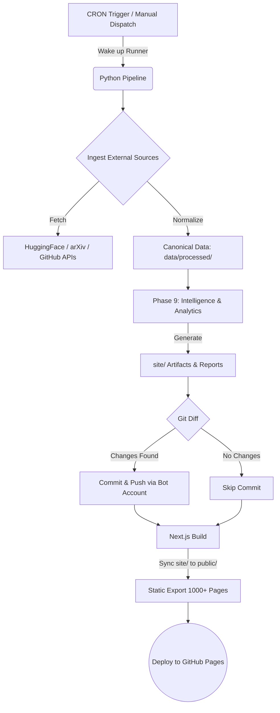
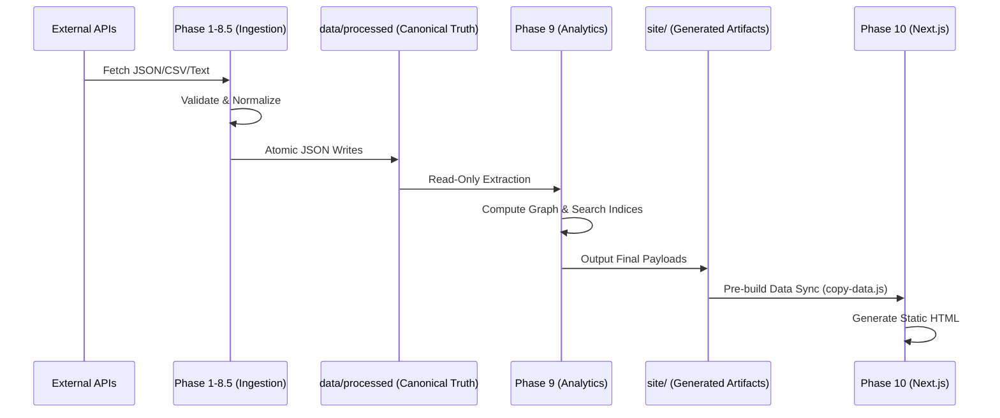

# 🌐 AI Intelligence Archive: Autonomous & Self-Updating Ecosystem


Welcome to the **AI Intelligence Archive**—a massively scalable, fully autonomous, self-updating, and completely serverless intelligence platform. This repository is not a static collection of files; it is an active, deterministic machine engineered to continuously ingest, organize, analyze, and visualize the explosive growth of the artificial intelligence ecosystem.

By leveraging a combination of highly strictly-typed Python data pipelines, GitHub Actions automation, and Next.js static site generation, this repository is **completely database-free**. It tracks thousands of models, datasets, tools, APIs, and workflows with absolute byte-for-byte reproducibility.

---

## 📑 Table of Contents
1. [Executive Summary](#-executive-summary)
2. [The Autonomous Bot Engine](#-the-autonomous-bot-engine)
3. [Ecosystem Scale & Statistics](#-ecosystem-scale--statistics)
4. [The 10-Phase Architectural Blueprint](#-the-10-phase-architectural-blueprint)
5. [End-to-End Data Flow](#-end-to-end-data-flow)
6. [Complete Repository Structure](#-complete-repository-structure)
7. [Artifact Generation & Manifests](#-artifact-generation--manifests)
8. [Pin-to-Pin Local Setup Guide](#-pin-to-pin-local-setup-guide)
9. [Execution & Validation Rules](#-execution--validation-rules)
10. [CI/CD Deployment Contract](#-cicd-deployment-contract)
11. [Safety & Determinism Mechanisms](#-safety--determinism-mechanisms)
12. [Contribution & Governance](#-contribution--governance)

---

## 🚀 Executive Summary

The AI ecosystem evolves faster than any human-maintained system can track. Information becomes instantly fragmented across huggingface, arXiv, GitHub, and proprietary API docs. 

**The AI Intelligence Archive solves this by:**
- Removing the database: Canonical truth is stored in atomic, schema-validated JSON files.
- Ensuring Determinism: Identical inputs always produce identical analytical outputs.
- Running Autonomously: A CI/CD bot scours the internet, fetches data, builds knowledge graphs, commits the data to GitHub, and deploys a Next.js visualization layer seamlessly.

---

## 🤖 The Autonomous Bot Engine

This repository runs itself. Using the `.github/workflows/sync.yml` workflow, the bot operates on a continuous, infinite scheduled loop.

### Autonomous Lifecycle
| Step | Action | Description | Engine |
|------|--------|-------------|--------|
| **1** | **Ingest** | Wakes up via CRON, hits external APIs (HuggingFace, GitHub, arXiv) and fetches massive raw datasets. | `massive_seed_fetcher.py` |
| **2** | **Normalize** | Parses raw data, validates it against strict JSON schemas, and resolves duplicates into canonical entities. | `canonical_snapshot_manager.py` |
| **3** | **Analyze** | Maps relationships, builds search indices, and creates a knowledge graph. (Phase 9) | `knowledge_graph_builder.py` |
| **4** | **Commit** | Detects diffs using `git` and commits directly to the `main` branch under the maintainer's profile. | `git commit` |
| **5** | **Build** | Triggers Next.js to statically export the massive JSON payloads into interactive HTML pages. | `npm run build` |
| **6** | **Deploy** | Pushes the statically generated `out/` bundle directly to GitHub Pages. | `actions/upload-pages-artifact` |

### Pipeline Orchestration Workflow


---

## 📊 Ecosystem Scale & Statistics

The repository currently acts as a central nervous system for the AI landscape, tracking entities at an unprecedented scale natively via JSON.

| Entity Category | Tracked Count | Purpose |
|-----------------|---------------|---------|
| **🤖 Base Models** | 2,000+ | Tracks LLMs, Vision models, Audio models, and their parameter sizes. |
| **📚 Datasets** | 2,080+ | Tracks training corpora, benchmarks, and licensing information. |
| **🧰 AI Tools** | 4,248+ | Open-source and commercial applications built on AI. |
| **🔌 APIs & Services** | 3,200+ | Hosted inference providers and cloud vector databases. |
| **📝 Prompts & Workflows** | 80,000+ | Curated prompt templates, system instructions, and agent workflows. |
| **🧠 Graph Relations** | 50,000+ | Semantic edge links connecting Models to the Datasets they were trained on. |
| **⚡ Generated Pages** | 1,022+ routes | Next.js pre-compiled HTML pages. Exported in under 12 seconds. |

---

## 🏛️ The 10-Phase Architectural Blueprint

The entire ecosystem was architected using strict phase boundaries. Phases 1-8.5 handle raw data, Phase 9 handles analytics, and Phase 10 handles the UI.

### Phase 1: Core Framework & Idempotency
Establishes the foundational logic for reading and writing files safely. Introduces atomic write operations to prevent partial data corruption if the pipeline crashes mid-execution.

### Phase 2: Live Intelligence Ingestion
Connects to external sources. Contains `massive_seed_fetcher.py` which interfaces with REST APIs, scrapes necessary structured metadata, and pulls it into the repository's `data/raw/` directory.

### Phase 3: Knowledge Expansion Layer
Introduces dynamic schema validation. Every piece of raw data is strictly validated against `schemas/*.schema.json` before being allowed to progress.

### Phase 4: Intelligence Processing Layer
Normalizes the data. It strips out malformed entries, standardizes timestamps, and structures all AI tools into unified dictionary schemas.

### Phase 5: Repository Stabilization Layer
The final validation phase for canonical data. This ensures that `data/processed/` only ever contains 100% verified, clean, and deterministically formatted JSON payloads. 

> **CRITICAL BOUNDARY:** Phases 1-5 mutate canonical data. Phases 6-10 are strictly **Read-Only**.

### Phase 6: Platform Intelligence & Ecosystem
Builds metadata registries (e.g. `source_registry.json`) that act as a directory of all external API endpoints and trust boundaries the system relies on.

### Phase 7: Autonomous Repository Governance
Implements the auditing and telemetry mechanisms. Generates the `reports/` directory containing data quality matrices and integrity checks.

### Phase 8 & 8.5: Mass Expansion
Massively parallelizes the ingestion engines to scale from a few hundred entities to tens of thousands without hitting API rate limits or out-of-memory errors.

### Phase 9: Intelligence & Discovery Layer
The analytical brain. It reads `data/processed/` and outputs pure frontend-ready state into `site/`.
- Computes macroscopic dashboard metrics.
- Slices the data into deterministically chunked `search_index.json` files for instant client-side searching.
- Builds a massive Knowledge Graph bridging relationships (e.g. `Model X -> trained on -> Dataset Y`).

### Phase 10: Interactive Explorer
The visual interface. A pure Next.js React application (`frontend/`) configured for `output: "export"`. It visually wraps the artifacts generated by Phase 9.

---

## 🌊 End-to-End Data Flow

The repository strictly forbids circular dependencies. Data flows in exactly one direction.



---

## 📁 Complete Repository Structure

Every folder serves an exclusive, non-overlapping purpose.

```text
ai-intelligence-archive/
│
├── .github/
│   └── workflows/
│       └── sync.yml               # 🤖 The Autonomous Bot Pipeline
│
├── data/
│   ├── metadata/                  # Central registries and schema indexing
│   │   ├── source_registry.json   # Trusted external API domains
│   │   └── api_manifest.json      # Endpoints for rate limiting
│   └── processed/                 # Canonical Entity JSONs (The Source of Truth)
│       ├── models/data.json       
│       ├── datasets/data.json     
│       ├── tools/data.json        
│       └── prompts/data.json      
│
├── docs/                          # Architectural Decision Records (ADRs) & Logs
│   ├── adr/
│   │   ├── 0001-no-database.md    # Why we don't use PostgreSQL/Mongo
│   │   └── 0002-determinism.md    # Rules for identical byte generation
│   └── architecture.md            
│
├── frontend/                      # 🌐 Next.js Interactive Explorer
│   ├── public/
│   │   └── site/                  # Automatically synchronized Phase 9 artifacts
│   ├── src/
│   │   ├── app/                   # Next.js App Router (Static Generation)
│   │   │   ├── entity/[type]/[id]/page.tsx  # Dynamic entity details
│   │   │   ├── graph/page.tsx     # Graph visualizer
│   │   │   ├── timeline/page.tsx  # Chronological ecosystem view
│   │   │   └── search/page.tsx    # Client-side instantaneous search
│   │   ├── components/            # Reusable Tailwind UI 
│   │   └── lib/                   # API bindings mapping to local JSON
│   ├── package.json               # Frontend dependencies & copy-data hook
│   ├── tsconfig.json              # Strict TypeScript definitions
│   └── next.config.ts             # Contains `output: "export"` constraint
│
├── reports/                       # Build logs, integrity checks, run manifests
│   ├── build_manifest.json        # Execution timings and validation booleans
│   └── data_quality_report.md     # Auto-generated QA metrics
│
├── schemas/                       # Authoritative JSON schemas to validate all data
│   ├── search_index.schema.json
│   └── entity_graph.schema.json
│
├── scripts/                       # 🐍 Python Pipeline Source Code
│   ├── lib/                       # Modular classes for isolation
│   │   ├── semantic_index_builder.py
│   │   ├── knowledge_graph_builder.py
│   │   └── artifact_manifest_generator.py
│   ├── main.py                    # Master Orchestrator Script
│   └── massive_seed_fetcher.py    # Raw data ingestion engine
│
├── site/                          # 📦 Phase 9 Generated Artifacts
│   ├── search/                    # Deterministically chunked search index JSONs
│   │   ├── chunk_a.json
│   │   ├── chunk_b.json
│   │   └── ...
│   ├── artifact_manifest.json     # Cryptographic signatures (SHA-256) for reproducibility
│   ├── dashboard_metrics.json     # Global stats for the UI
│   ├── entity_graph.json          # Node and edge mapping
│   ├── index_manifest.json        # Frontend schema compatibility manifest
│   └── timeline.json              # Chronological event tracking
│
├── tests/                         # PyTest suites validating interfaces and determinism
├── requirements.txt               # Production Python dependencies
├── requirements-dev.txt           # Testing Python dependencies
└── README.md                      # You are here!
```

---

## 🗃️ Artifact Generation & Manifests

Phase 9 compiles incredibly dense, heavily optimized artifacts.

### The Artifact Manifest (`site/artifact_manifest.json`)
Every single JSON file exported into `site/` is cryptographically hashed using **SHA-256**. The `artifact_manifest.json` tracks exactly what was built, ensuring that a run today and a run tomorrow (with identical inputs) produce identical hashes.

### Search Chunking (`site/search/*`)
Because injecting 50,000+ records into the browser at once would cause an Out-Of-Memory (OOM) crash, `semantic_index_builder.py` deterministically chunks the index alphabetically by token prefix (`chunk_a.json`, `chunk_b.json`, etc.). The frontend dynamically fetches only the chunks the user types.

---

## ⚙️ Pin-to-Pin Local Setup Guide

If you want to run the pipeline, verify determinism, or contribute to the frontend, follow this exact guide.

### 1. Clone the Repository
```bash
git clone https://github.com/salmaanfarisshaik-art/ai-intelligence-archive.git
cd ai-intelligence-archive
```

### 2. Backend Setup (Python)
The backend pipeline requires **Python 3.11 or higher**.

```bash
# Create an isolated virtual environment
python -m venv venv

# Activate it (Windows PowerShell)
venv\Scripts\activate
# Activate it (Mac/Linux Bash)
source venv/bin/activate

# Upgrade pip to prevent dependency conflicts
python -m pip install --upgrade pip

# Install required packages
pip install -r requirements.txt
pip install -r requirements-dev.txt
```

### 3. Environment Configuration
Create a `.env` file in the absolute root directory. This allows the ingestion script to hit protected API endpoints.
```env
DRY_RUN=false
GEMINI_API_KEY=your_gemini_key
GITHUB_TOKEN=your_github_token
# Note: Do NOT commit this file to git. It is safely ignored by .gitignore!
```

### 4. Run the Pipeline Orchestrator
Execute the main script. This will fire off Phase 1 through 9. Watch your terminal output as it logs the ingestion, validation, and analytics generation.
```bash
python scripts/main.py
```
*Note: Depending on network speeds and external API limits, a fresh ingestion can take several minutes.*

### 5. Frontend Setup (Next.js)
Once the Python pipeline has fully generated the artifacts into the `site/` directory, you can build the Next.js visualizer.

```bash
# Navigate into the frontend layer
cd frontend

# Install Node dependencies
# Note: Do NOT use `npm ci` locally if you plan to update dependencies, use `npm install`.
npm install

# Run the local development server (Hot Reloading enabled)
npm run dev
# -> Open your browser to http://localhost:3000

# OR build the production static export
npm run build
```

---

## 🛡️ Execution & Validation Rules

You can run automated tests to verify the determinism of the pipeline.

```bash
# Ensure you are in the root directory and the virtual env is active
pytest tests/
```

### The DRY_RUN Contract
If you set `DRY_RUN=true` in your `.env` file, the orchestrator will fetch data and process analytics entirely in memory. It guarantees **0 bytes are altered on disk**, making it safe to test new scripts without risking your canonical data payloads.

---

## 🚢 CI/CD Deployment Contract

The GitHub Actions workflow (`.github/workflows/sync.yml`) utilizes several crucial safeguards:

- **Lockfile OS Parity:** It explicitly utilizes `npm install` instead of `npm ci` to handle cross-OS SWC binary dependencies. Windows requires different Next.js binaries than the `ubuntu-latest` runner used in GitHub Actions.
- **Auto-Commit Tagging:** Uses the `[skip ci]` tag inside its automated commit messages to prevent infinite, recursive workflow loops.
- **Memory Bounding:** The Next.js `generateStaticParams` method limits dynamic entity generation to subsets (e.g., top 100 per category) to prevent memory overflows during the static HTML compilation phase.

---

## 🔒 Safety & Determinism Mechanisms

The system operates under several unbreakable architectural contracts:
- **Frontend Consumption Boundary:** The Next.js frontend is strictly forbidden from reading raw data. It may only read the hashed, validated payloads inside `site/`.
- **Atomic File Operations:** All artifacts are built in temporary paths (e.g. `site_tmp/`) and swapped atomically using OS-level commands to prevent partial writes if a process is killed.
- **Canonical Ordering Contract:** All generated JSON arrays and objects are strictly sorted by Canonical ID (e.g. alphabetical or numerical). This ensures that identical inputs always generate byte-for-byte identical artifacts, regardless of what operating system or CPU ran the python script.

---

## 🤝 Contribution & Governance

Contributions are heavily encouraged! The modularity of this system makes it very difficult to accidentally break the core pipeline.

### How to Contribute
1. **Frontend:** Navigate to `frontend/src/` and tweak the TailwindCSS components. Since it relies on static JSON, you don't need a database to test UI changes!
2. **Backend (New Ingestion):** Create a new parser in `scripts/lib/`. Ensure it outputs valid JSON and strictly adheres to the `data/processed/` schemas.
3. **Analytics (Phase 9):** Add a new generator to output specialized analytics (e.g. a geographical heat map of AI models). Append it to `site/` and register it in `artifact_manifest_generator.py`.

### Pull Request Rules
- Run `python scripts/main.py` locally before committing.
- Ensure `reports/build_manifest.json` successfully logged your execution without critical schema failures.
- Do not introduce **any** external backend service, docker container, or runtime database requirement. This project must remain 100% Static & Serverless.

---
*Architected and maintained autonomously by GitHub Actions under the [@salmaanfarisshaik-art](https://github.com/salmaanfarisshaik-art) profile.*
