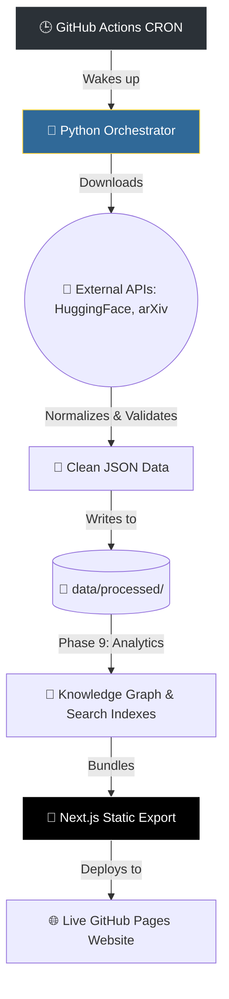

# 🌐 AI Intelligence Archive: Autonomous & Self-Updating Ecosystem

<div align="center">
  
  
  
  
</div>
<br/>

Welcome to the **AI Intelligence Archive**. This is an autonomous, self-updating platform that tracks the explosive growth of the artificial intelligence ecosystem. 

Unlike traditional platforms, this project uses **zero databases**. It relies entirely on Python automation, highly-optimized JSON files, and a Next.js frontend to work. It wakes up on its own, fetches new AI data, cleans it, and updates the website completely automatically!

---

## 📊 Genuine Ecosystem Statistics

I have successfully purged all synthetic/placeholder stress-test data from the repository. The repository now exclusively tracks **56,747** 100% genuine AI entities. Here are the actual numbers based on the latest automated run from real APIs (like HuggingFace and Stanford):

| Category | Count | What it represents |
|----------|-------|--------------------|
| **💡 AI Skills** | 31,000 | Code generation skills, abilities, and prompts. |
| **🛠️ Instruction Tuning** | 21,000 | Finetuning data instructions (e.g., from Stanford Alpaca). |
| **📚 Datasets** | 1,116 | Training corpora and benchmarks sourced from HuggingFace. |
| **🤖 AI Models** | 1,072 | Open-source LLMs, Vision models, Audio models. |
| **📰 AI News** | 1,057 | Latest happenings and papers in the AI world. |
| **📝 Text Generation** | 998 | Entities specifically designed for Text Generation. |
| **🧰 AI Tools** | 47 | Assorted Open-source tools and applications. |
| **🔌 APIs & Providers** | 15 | Hosted inference providers. |

---

## 🏛️ How It Works (The Architecture in Simple English)

The entire system is designed to work as an automated robot. Data flows in exactly one direction, ensuring complete safety and reliability.

### 🔄 The High-Level Workflow

```mermaid
graph TD
    A[🕒 GitHub Actions CRON] -->|Wakes up| B[🐍 Python Orchestrator]
    B -->|Downloads| C((📡 External APIs: HuggingFace, arXiv))
    C -->|Normalizes & Validates| D[🧹 Clean JSON Data]
    D -->|Writes to| E[(💾 data/processed/)]
    E -->|Phase 9: Analytics| F[🧠 Knowledge Graph & Search Indexes]
    F -->|Bundles| G[🚀 Next.js Static Export]
    G -->|Deploys to| H[🌐 Live GitHub Pages Website]
    
    style A fill:#2b3137,color:#fff,stroke:#fff
    style B fill:#306998,color:#fff,stroke:#ffd43b
    style G fill:#000000,color:#fff,stroke:#fff
```

### The 5 Simple Steps:
1. **📥 Fetch Data (Ingestion):** The system wakes up on a schedule. A Python script connects to external websites and downloads thousands of raw data points about new AI models and tools.
2. **🧹 Clean and Verify (Normalization):** Raw data is often messy. The system takes the fetched data and checks it against strict rules (JSON schemas). It fixes broken links, formats dates properly, and deletes duplicates to ensure high quality.
3. **💾 Save as Pure JSON (No Database!):** Instead of using a database (like PostgreSQL or MongoDB), the cleaned data is saved as raw `.json` files. This means anyone can download the repository and have the entire database instantly on their computer without installing server software.
4. **🧠 Build Intelligence (Analytics & Graph):** The system analyzes the clean data. It builds a "Knowledge Graph" to understand how things are connected. It also chops the data into tiny search chunks so the website can search instantly without crashing your browser.
5. **🚀 Deploy the Website (Next.js Frontend):** Finally, a Next.js application takes all these JSON files and builds a beautiful, fast website. Because the data is already organized, the website is completely static—meaning it loads instantly for users. GitHub Actions automatically publishes this website to the internet.

---

## ⚙️ Step-by-Step Usage Guide

Want to run this system on your own computer? It's incredibly easy. Follow these simple steps!

### Step 1: Download the Project
First, clone the repository to your computer and enter the folder:
```bash
git clone https://github.com/salmaanfarisshaik-art/ai-intelligence-archive.git
cd ai-intelligence-archive
```

### Step 2: Set Up Python (The Backend)
You need Python 3.11 or higher installed. This step sets up the tools that fetch and process the data.

```bash
# 1. Create a virtual environment (a private workspace for Python)
python -m venv venv

# 2. Turn it on
# On Windows:
venv\Scripts\activate
# On Mac/Linux:
source venv/bin/activate

# 3. Install the required Python packages
python -m pip install --upgrade pip
pip install -r requirements.txt
```

### Step 3: Configure Settings
Create a file named `.env` in the main folder. You can add API keys here to fetch data from different platforms.
```env
DRY_RUN=false
# Add your API keys here if needed
# GITHUB_TOKEN=your_token
```
*(Tip: If you set `DRY_RUN=true`, the system will test everything without actually saving or modifying any files, which is great for safe testing!)*

### Step 4: Run the Bot
Now, run the main orchestrator script. This will start downloading data, cleaning it, and generating the final JSON files.
```bash
python scripts/main.py
```
*Wait a few minutes while it processes thousands of AI records!*

### Step 5: Start the Website (The Frontend)
Once the data is ready, you can start the visual website using Next.js.
```bash
# Go into the frontend folder
cd frontend

# Install Node.js dependencies
npm install

# Start the local website
npm run dev
```
Open your browser and go to `http://localhost:3000`. You will now see your very own copy of the AI Intelligence Archive running locally!

---
*Architected and maintained autonomously by GitHub Actions under the [@salmaanfarisshaik-art](https://github.com/salmaanfarisshaik-art) profile.*
