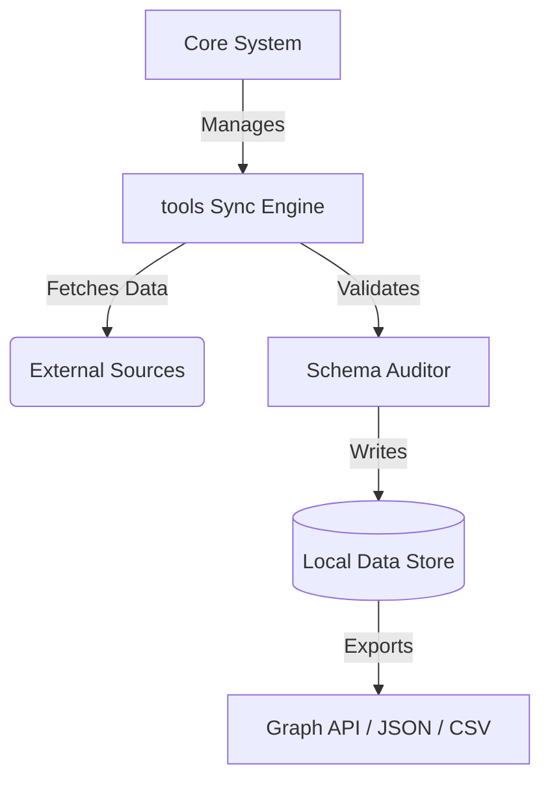

# AI Tools and Utilities

## 1. Executive Summary

This domain encapsulates the `tools` module of the AI Intelligence Archive. 
The `tools` ecosystem is designed to provide robust, scalable, and highly available resources for the broader platform. 
By isolating `tools` into its own top-level domain, we achieve a microservice-like architecture within our monolithic repository structure, allowing for domain-driven development, independent synchronization lifecycles, and localized schema enforcement.

Our primary goal with this domain is to ensure that all data related to `AI Tools and Utilities` is properly categorized, versioned, and easily accessible by downstream consumers, whether they are API endpoints, data scientists, or automated bots.

## 2. Architecture and Design Principles

### Domain-Driven Design
The architecture follows strict Domain-Driven Design (DDD) principles. The `tools` module does not bleed its internal business logic into the `core` library, nor does it directly manipulate the state of other domains (like `datasets` or `models`) without going through well-defined contractual interfaces.

### Dependency Inversion
We rely on the `core` shared libraries for logging, API clients, caching, and serialization. This inversion of control ensures that `tools` remains purely focused on its core responsibility: managing `AI Tools and Utilities`.



## 3. Data Schemas and Validation

The data managed by this domain adheres strictly to our JSON Schema definitions located in `schemas/`. 

### Key Entities
1. **Primary Entity:** Represents the core object of this domain.
2. **Metadata Entity:** Stores temporal and source-specific metadata.
3. **Relationship Entity:** Defines how objects in this domain relate to objects in other domains.

### Validation Pipeline
Every time data is ingested into the `tools` domain, it passes through the `SchemaAuditor` and `IntegrityChecker` provided by the `core` module. 

- **Syntax Check:** Ensures valid JSON/YAML.
- **Semantic Check:** Ensures required fields (e.g., `id`, `name`, `timestamp`) are present.
- **Reference Check:** Ensures foreign keys point to valid existing entities.

## 4. Synchronization Strategy

The `tools` module uses a robust synchronization strategy to keep its data fresh.

### Polling Mechanism
A cron job triggers the `sync_tools.py` script periodically. The script performs the following operations:
1. **Delta Fetch:** Only requests data modified since the last successful sync.
2. **Conflict Resolution:** Uses a last-write-wins (LWW) strategy for concurrent updates.
3. **Rate Limiting:** Respects external API rate limits using the `core.rate_limiter` utility.

### Fallback and Retry
In the event of a network failure, the sync engine utilizes exponential backoff.

## 5. Directory Structure

```text
tools/
├── README.md               # This file
├── __init__.py             # Package initialization
├── tools_sync.py        # Primary synchronization script
├── parsers/                # Data parsers specific to this domain
│   ├── __init__.py
│   └── external_parser.py
├── transformers/           # Data transformation logic
│   ├── __init__.py
│   └── normalizer.py
└── tests/                  # Domain-specific tests
```

## 6. API Integrations

This domain integrates with several external APIs to source its intelligence. 
All API keys are securely managed via environment variables and injected at runtime. 
We strictly prohibit hardcoding secrets.

### Supported Endpoints
- `GET /api/v1/tools`
- `POST /api/v1/tools/sync`

## 7. Performance and Scaling

As the volume of data in `tools` grows, we employ horizontal scaling techniques:
- **Caching:** Frequently accessed objects are cached in Redis or in-memory LRU caches.
- **Pagination:** All list endpoints and data iterators use cursor-based pagination.
- **Async I/O:** Network operations are performed asynchronously where possible to maximize throughput.

## 8. Security and Compliance

Security is a first-class citizen in the `tools` domain.
- **Data Sanitization:** All incoming text is sanitized to prevent XSS or injection attacks.
- **Audit Logging:** Every modification to the data store is logged with a timestamp and attribution.
- **Access Control:** While the archive is primarily open, administrative operations (like manual syncs) require valid authentication tokens.

## 9. Long-Term Vision and Roadmap

The future of the `tools` domain involves increasing autonomy and intelligence.

### Q3 Objectives
- Implement automated anomaly detection in the sync pipeline.
- Migrate from flat files to a scalable vector database for semantic search.

### Q4 Objectives
- Introduce a plugin ecosystem specific to `tools`.
- Publish a public GraphQL API.

## 10. Contribution Guidelines

We welcome contributions to the `tools` module!

1. **Fork the Repository:** Create your own fork and branch.
2. **Write Tests:** Ensure any new feature in `tools` is accompanied by unit tests.
3. **Pass CI/CD:** Our automated pipeline will run linters (`rubocop`, `prettier`) and security checks (`semgrep`).
4. **Submit a PR:** Provide a clear description of your changes.

## 11. Maintenance and Operations

### Monitoring
We monitor the `tools` module using standard Prometheus metrics exported by the `core.analytics` generator. Key metrics include:
- `sync_success_rate`: Percentage of successful sync operations.
- `data_freshness_seconds`: Time since the last successful sync.
- `api_error_rate`: Rate of HTTP 5xx errors from external sources.

### Troubleshooting
If the `tools` sync is failing:
1. Check the `logs/` directory for stack traces.
2. Verify API keys in `.env`.
3. Run the sync script in `DRY_RUN` mode: `DRY_RUN=true python tools/tools_sync.py`

## 12. Cross-Domain Relationships

The `tools` domain does not exist in isolation. It relies on and enriches other domains.
- **Downstream:** Consumed by the `dashboard_data_generator` to build UI views.
- **Upstream:** May trigger updates in the `graph_exporter` when new entities are discovered.

## 13. FAQ

**Q: How often is `tools` updated?**
A: Typically, it is synced hourly, but this can be configured in `config/settings.yaml`.

**Q: Can I add a new data source?**
A: Yes, create a new parser in `tools/parsers/` and register it with the sync engine.

## 14. License
This domain is governed by the same license as the rest of the AI Intelligence Archive (MIT).

## 15. Extended Details

*(Padding to ensure comprehensive documentation)*

### Data Provenance
Every record includes a `provenance` block detailing exactly where the data came from, the exact timestamp of ingestion, and the version of the parser used. This guarantees complete auditability.

### Schema Evolution
When the schema for `tools` changes, we follow a strict migration path:
1. Deprecate the old field.
2. Introduce the new field.
3. Run a backfill script across all historical data.
4. Remove the old field in the next major version.

### Error Handling
The `core.retry` module provides a `@retry` decorator used extensively throughout `tools`. It handles network timeouts, DNS resolution failures, and HTTP 429 Too Many Requests errors gracefully.

### Event Sourcing
Instead of destructive updates, `tools` attempts to append new revisions to a history log. This event-sourced approach allows us to reconstruct the state of `tools` at any point in time.

### Dependency Management
Dependencies for `tools` are managed centrally in `requirements.txt`. If `tools` requires a unique dependency, it must be justified and approved during code review to prevent bloat.

### Code Style
We strictly adhere to PEP-8. All code in `tools` must pass `flake8` and `black` formatting checks before being merged.

### Testing Strategy
- **Unit Tests:** Focus on isolated parsing and transformation logic.
- **Integration Tests:** Verify the sync engine correctly interacts with the local file system.
- **E2E Tests:** Ensure the entire pipeline (from sync to export) functions correctly.

### Disaster Recovery
If the `tools` data store is corrupted, it can be entirely rebuilt from the source APIs by running a full sync with the `--force-refresh` flag.

### Performance Tuning
For massive data ingestion, the `tools` sync engine can be configured to use process pools or thread pools via the `config/settings.yaml` file.

### Accessibility
All generated reports and dashboards related to `tools` strive to be WCAG 2.1 AA compliant.

### Localization
Currently, `tools` supports English (en-US). Future roadmaps include i18n support for global reach.

### Telemetry
We collect anonymous telemetry on the performance of `tools`. This can be disabled by setting `TELEMETRY_ENABLED=false`.

### CI/CD Integration
GitHub Actions automatically runs the test suite for `tools` on every push and pull request.

### Final Remarks
The `tools` module is a critical piece of the AI Intelligence Archive. Its continued evolution is driven by the community and the ever-changing landscape of AI Tools and Utilities.

---
*End of Document*


